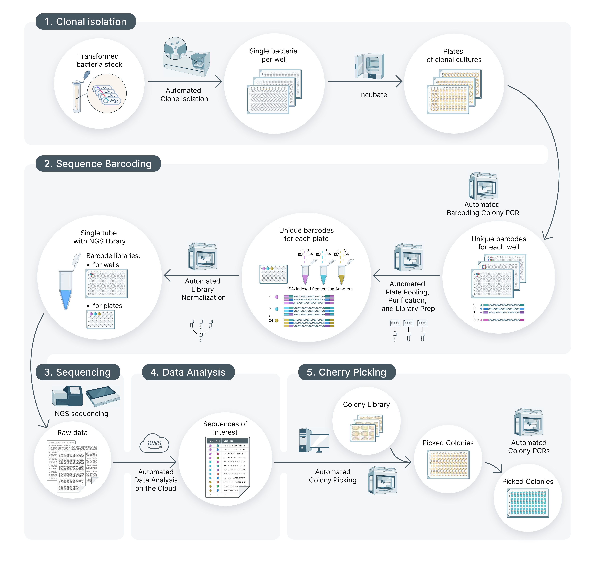

`parSEQ: ` **ADVANCED PROBE AND RESCUE SEQUENCING FOR
ENHANCED VARIANT RETRIEVAL FROM DNA POOL**

### Read our technical report on parSEQ (Link)

**This python library accompanies our parSEQ technical report. parSEQ is an experimental platform that was developed to ingest bacterial pools of variants -proteins and other- (where each variant is encoded on a plasmid in the bacteria), and deliver sequence-verified, individually separated variants. The process begins with the distribution of bacteria from collective pools into separate clonal wells. After this, parSEQ employs a two-level barcoding system for enhanced multiplexing, incorporating both well-specific and plate-specific barcodes. Once barcoded, samples are merged for Next-Generation Sequencing (NGS), after which the NGS data is analyzed to link each variant with its respective well. Operating within a 384-well plate setup, and supported by automated procedures and Python-based data analysis, parSEQ constitutes an important tool in modern protein engineering processes. While initially dependent on Illumina sequencing for detailed results, recent advancements in Oxford Nanopore (ONT)’s v14 chemistry and improved basecalling algorithms now position Nanopore sequencing as an effective substitute.**

The figure above describes the parseq process workflow that we have implemented at Adaptyv Biosystems. Refer to our parSEQ technical report section 2.1 (parSEQ Process Description) for a detailed explanation of the process. Note that you can use parSEQ with a different setup. Refer to our parSEQ technical report section 2.2 (Easy Implementation of parSEQ across Labs of Varying Scales) for an overview of the different options available for setting up your own parSEQ process.

-------------------
-------------------

### Analyzing parSEQ Results

This library was developed to analyze parSEQ sequencing results. It can be used to analyze sequencing results from both Illumina and Nanopore sequencers. This sequencing library accepts raw sequencing fastq files as input. Each fastq file contains the sequencing output for one 384-well plate. In the figure above, this would be the output from step 3 (Sequencing).
We intended to make this library available for the sequencing output of both Illumina and Nanopore (including different basecalling options for Nanopore), and such, we purposefully start from one fastq-file per plate.

-------------------

#### Input format

- In case of Illumina paired-end sequencing, please merge the paired-end reads using any opensource tool such as flash or fastp to provide one fastq file per plate. Fastq files should contain only adapter trimmed sequences.
- In case of Nanopore sequencing, please provide one concatenated fastq file per plate post basecalling. Fastq files should contain only adapter trimmed sequences.

Provided fastq files can be zipped or unzipped.

-------------------

#### Analysis pipeline

parSEQ analysis library is intended to be used with a notebook similar to the provided notebook template (parseq_run_notebook). The analysis pipeline is separated into 5 big sections as portrayed in the notebook. 

**Setup Run**
- Ceates a folder with the run name (run directory) in the output directory.
- Copies raw fastq files to a folder named raw_data in the run directory.
- Initializes a json file that will be updated throughout the analysis process to capture all important run information.
- Provides a histograms with stats on the number of sequences, and the average, min, max, and std of sequence length.
- Saves the histograms to /run_directory/fastq_length_histograms/raw_fastq.

**Data Filtering and QC**
- Filters raw reads in fastq files for length and phred quality score.
- Outputs a filtered fastq file along with .html and .json quality description files per plate to  /run_directory/fastp_output/plate.
- Outputs length histogram along with length stats to /run_directory/fastq_length_histograms/post_fastp for each plate.
- Updates json file with relevant information.

**Read Demultiplexing**
- Uses freebarcodes software to assign a barcode to each of the reads in each of the post_fastp fastq files.
    - Freebarcodes decoding uses barcoding mapping csv
    - Freebarcodes decoding does barcode search with error provided
    - Outputs text file for each plate with barcode assigned to each read in /run_directory/freebarcodes_output
- Separates reads from freebarcodes decoded file into respective well-level fasta files for each plate in /run_directory/demultiplexed/plate
    - Uses constant regions to get the fwd read of any reverse read, such that the fasta files contain fwd reads only.
    - Separation of freebarcodes decoded files into wells runs in parallel for the plates based on the multiprocessing_cores parameter provided.
- Provides plate level csv files for demultiplexed reads and number of reads per well.
- Updates json file with relevant information.

**Alginment & Consensus**

- Aligns every demultiplexed fasta file in  /run_directory/demultiplexed/plate and outputs aligned fasta file to /run_directory/aligned/plate.
    - Alignment algorithm options: mafft, muscle.
    - Alignment runs in parallel for the plates based on the multiprocessing_cores parameter provided.
- Calculates consensus sequence for every well of every plate with the provided consensus_threshold and ambiguous base.
    - Provides plate level csv files for raw consensus and stats /run_directory/consensus/raw_consensus.
    - Consensus runs in parallel for the plates based on the multiprocessing_cores parameter provided.
- Provides a run level csv file for raw consensus and stats under /run_directory.

Note that consensus sequences output at this step contain the well-level barcodes. They can be trimmed using the trimming and reconstruction oprion below.

**Trimming & Reconstruction**
Trimming and reconstruction is optional.
- Processes consensus csv files to trim 5' and 3' end based on the trim parameters provided. Trimming is optional
- Processes consensus csv files to add 5' and 3' end sequences based on the reconstruction parameters provided. Reconstruction is optional.
- Provides plate level trimmed & reconstructed consensus and stats under /run_directory/consensus/trimmed_reconstructed_consensus.
- Provides run level csv file for trimmed & reconstructed consensus and stats under /run_directory.

**Results Visualization**
- Creates visualizations based on the consensus sequences.
- Visualizations are based can based on raw consensus results or trimmed & reconstructed consensus results.
- Creates both plate-level and run-level visualizations
- Visualizations are intended to give a holistic view of the parSEQ run performance.

-------------------

